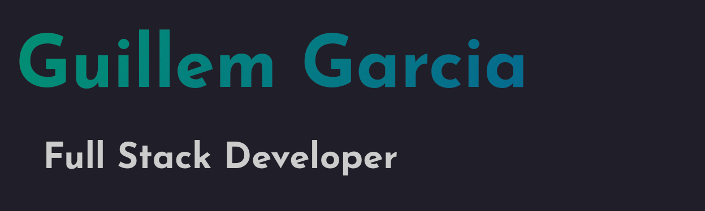

## Hello there! I'm Guillem Garcia, a full stack developer based in Barcelona 👋

I love bringing ideas to life using code, whether it is just for fun or as part of meaningful projects, and I'm confident with my skills in both the front end and the back end.

I'm an outdoor enthusiast, so in my free time I enjoy going to the mountains and practicing hiking, climbing, alpinism... I'm also a bookworm with special interest for philosphy, sciences and classical literature.

  

## What's I'm doing now

- 🌱 I’m currently learning:  and  
- 📫 How to reach me: <a href="https://linkedin.com/in/guillemgarciagomez
">Connect with me in LinkedIn</a>
- 💬 Ask me about developing GraphQL back ends using TypeScript
- 😄 Pronouns: he/him/his
- ⚡ Fun fact: I'm trying to learn mongolian throat singing

### My Languages and tools

<code></code>
<code></code>
<code></code>
<code></code>
<code></code>
<code></code>
<code></code>
<code></code>
<code></code>
<code></code>

  

    Illustration by <a href="https://dribbble.com/Smetanov">Aleksandr Smetanov</a> from <a href="https://icons8.com/">Icons8</a>
  

<!--
**guillemgarciagomez/guillemgarciagomez** is a ✨ _special_ ✨ repository because its `README.md` (this file) appears on your GitHub profile.

Here are some ideas to get you started:

- 🔭 I’m currently working on ...
- 🌱 I’m currently learning ...
- 👯 I’m looking to collaborate on ...
- 🤔 I’m looking for help with ...
- 💬 Ask me about ...
- 📫 How to reach me: ...
- 😄 Pronouns: ...
- ⚡ Fun fact: ...
-->
